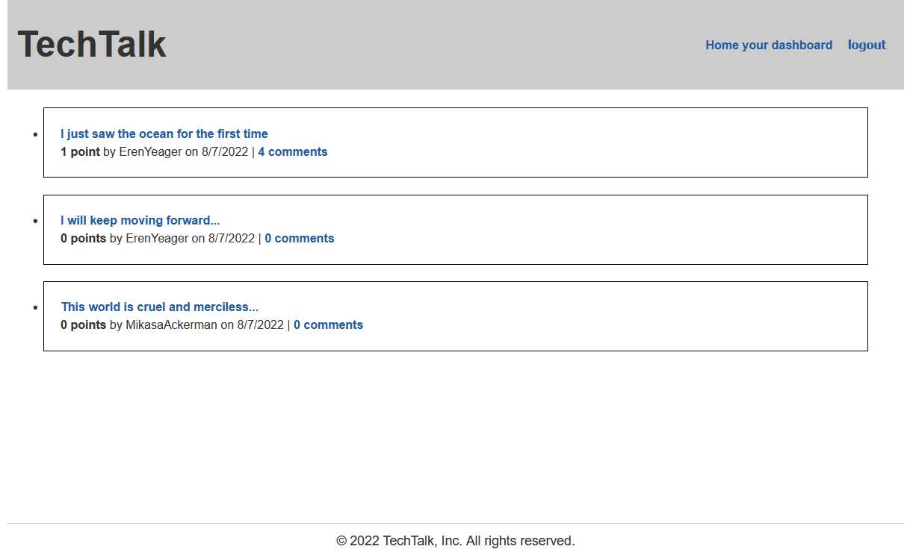

# TechTalk

## Description
TechTalk is a Wordpress-style blog for reading about, writing about, and discussing tech-related topics. Upon first visiting the site, a unique user will be presented with the homepage, where the most recent blog posts are listed. By clicking the "login/sign up" link, the user can either log in using previously created credentials, or they may sign up for a new account. Once logged in, a user can not only view posts, but also upvote and comment on them. In addition, they may create and edit their own posts for other users to comment on and upvote.

